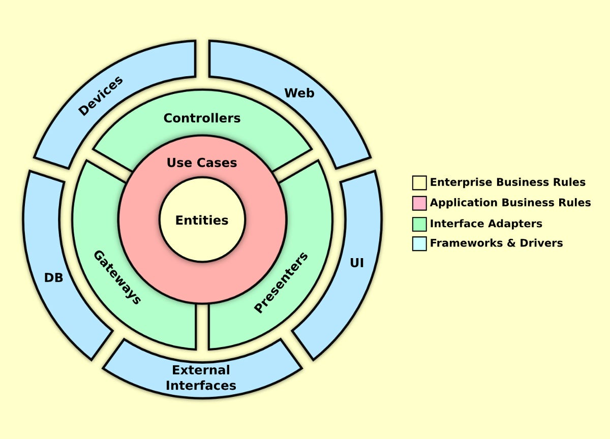

# Architecture Overview

This page proves that we can add additional Markdown documents and expose them through the generated documentation site.

## Purpose

This documentation site is generated from Markdown and published as browsable HTML.

Here is a generic diagram of Solid Architecture:

Just so we can see how it renders.

> Styling is applied centrally through `docs/styles.css`.